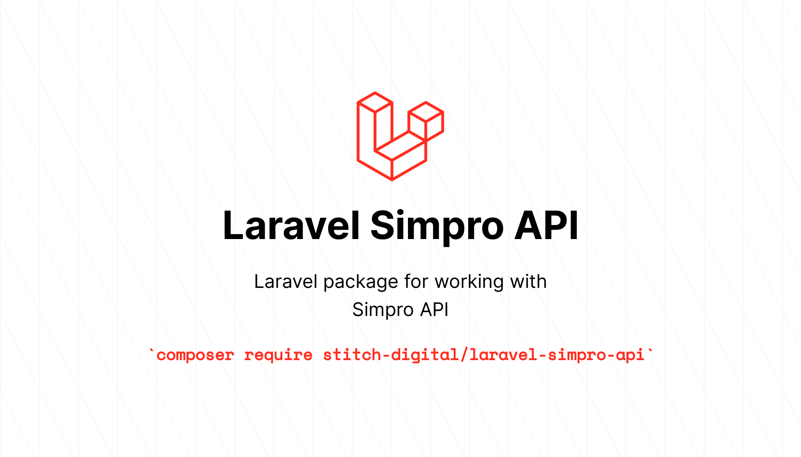

# Laravel package for working with the Simpro API

[](https://packagist.org/packages/stitch-digital/laravel-simpro-api)
[](https://github.com/stitch-digital/laravel-simpro-api/actions?query=workflow%3Arun-tests+branch%3Amain)
[](https://github.com/stitch-digital/laravel-simpro-api/actions?query=workflow%3A"Fix+PHP+code+style+issues"+branch%3Amain)
[](https://packagist.org/packages/stitch-digital/laravel-simpro-api)



Laravel Simpro is a robust package designed to seamlessly integrate your Laravel application with the Simpro API.

The full Simpro API documentation can be [found here](https://developer.simprogroup.com/apidoc/).

## Installation

Laravel Simpro API can be installed using composer:

```bash
composer require stitch-digital/laravel-simpro-api
```

Then publish the config file:

```bash
php artisan vendor:publish --tag="simpro-api-config"
```

This will publish the configuration file to `config/simpro-api.php` where you can configure your settings:

```php
return [

    /*
    |--------------------------------------------------------------------------
    | Simpro Base URL
    |--------------------------------------------------------------------------
    |
    | Set the base URL for the Simpro API. This option is not required when
    | using a multi-tenancy setup, as values are passed in the constructor.
    |
    */

    'base_url' => env('SIMPRO_BASE_URL'),

    /*
    |--------------------------------------------------------------------------
    | Simpro API Key
    |--------------------------------------------------------------------------
    |
    | Set the API key for the Simpro API. This option is not required when
    | using a multi-tenancy setup, as values are passed in the constructor.
    |
    */

    'api_key' => env('SIMPRO_API_KEY'),

    /*
    |--------------------------------------------------------------------------
    | Cache Configuration
    |--------------------------------------------------------------------------
    |
    | Enable or disable caching for Simpro GET requests. The cache driver can
    | be set to any of the Laravel cache drivers. The cache expiry time is
    | set in seconds.
    |
    */

    'cache' => [
        'enabled' => true,
        'driver' => 'database',
        'expire' => 120,
    ],

    /*
    |--------------------------------------------------------------------------
    | Rate Limit Configuration
    |--------------------------------------------------------------------------
    |
    | Set the rate limit for Simpro requests. The rate limit is set per second
    | and the threshold is the percentage of the rate limit that is accepted.
    | The threshold must be a number between 0 and 1 (e.g. 0.5 for 50%).
    |
    | The default rate limit is as per the Simpro API documentation.
    |
    */

    'rate_limit' => [
        'enabled' => true,
        'per_second' => 10,
        'driver' => 'database',
        'threshold' => 0.8,
    ],

    /*
    |--------------------------------------------------------------------------
    | Global Retry Configuration
    |--------------------------------------------------------------------------
    |
    | Set the number of retries for all requests. This can still be overridden
    | on a per-request basis, by chaining sendAndRetry() to the request:
    |
    | Example:
    | $response = $connector->sendAndRetry($request, 1);
    |
    */

    'global_retries' => 3, // Set to null to disable global retries

];
```

This package is built using Saloon. Check out their [documentation here](https://docs.saloon.dev/).

## Usage

### Using a Single Simpro Connection
If you are using a single Simpro connection, you can add the following environment variables to your `.env` file:

```bash
SIMPRO_BASE_URL=https://your-build-url.simprosuite.com
SIMPRO_API_KEY=your-api-key
```

To use the package, you can use the Simpro facade to make requests to the API:

```php
use StitchDigital\LaravelSimproApi\Facades\Simpro;
use StitchDigital\LaravelSimproApi\Requests\Info\GetInfo;

$response = Simpro::send(new GetInfo())->json();
```

### Using Multiple Simpro Connections
If you are using multiple Simpro connections, you can pass the base URL and API key to the constructor of the request - although this means you can no longer user the facade:

```php
use StitchDigital\LaravelSimproApi\LaravelSimproApi;
use StitchDigital\LaravelSimproApi\Requests\Info\GetInfo;

$connector = new LaravelSimproApi(
    baseUrl: 'https://custom-api-url.simprosuite.com',
    apiKey: 'custom-api-key'
);

$response = $connector->send(new GetInfo());

$response->json();
```

### Available Requests

For a full list of available requests, use the following command:

```bash
php artisan simpro:list-requests
```

This package is still in development and not all API endpoints are available yet. We are working on this package regularly as we use it for client projects, with regular releases to add more requests. If you see a missing request, please feel free to create a pull request and contribute!

### Changelog

Please see [CHANGELOG](CHANGELOG.md) for more information what has changed recently.

## Contributing

Contributions are welcome and will be fully credited! Contributions are accepted via Pull Requests on [Github](https://github.com/stitch-digital/laravel-simpro-api).

### Security

If you discover any security related issues, please email john@stitch-digital.co instead of using the issue tracker.

## Credits

-   [John Trickett](https://github.com/johntrickett86)
-   [Anthony Elleray](https://github.com/AElleray)
-   [All Contributors](../../contributors)

## License

The MIT License (MIT). Please see [License File](LICENSE.md) for more information.
